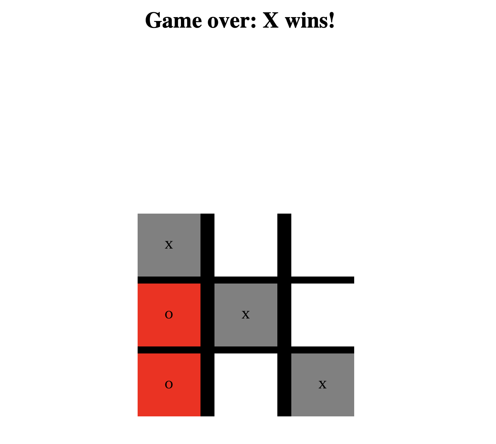

# tic-tac-toe

Just a simple tic tac game to practice using vanilla js after living in React world for years.

## How to Run

Clone the repo, then open the index.html file in the browser of your choice. If you chose internet explorer, that's on you.

